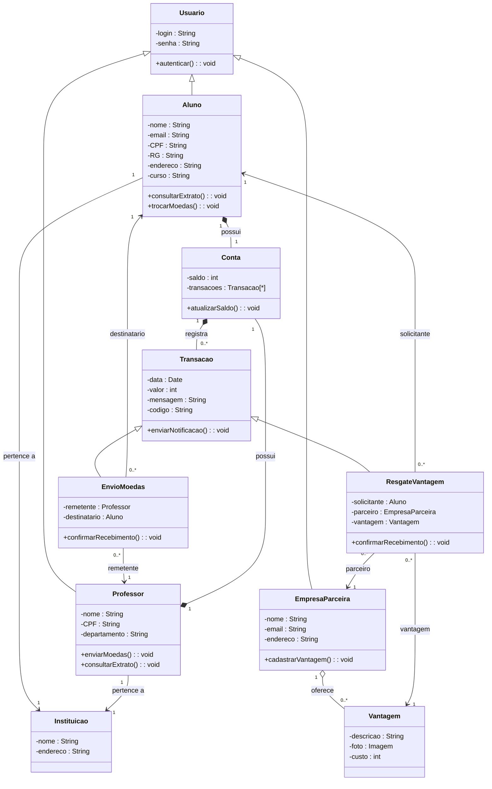

# Diagrama de classes

```mermaid
classDiagram

class Usuario {
    -login : String
    -senha : String
    +autenticar() : void
}

class Aluno {
    -nome : String
    -email : String
    -CPF : String
    -RG : String
    -endereco : String
    -curso : String
    +consultarExtrato() : void
    +trocarMoedas() : void
}

class Professor {
    -nome : String
    -CPF : String
    -departamento : String
    +enviarMoedas() : void
    +consultarExtrato() : void
}

class EmpresaParceira {
    -nome : String
    -email : String
    -endereco : String
    +cadastrarVantagem() : void
}

class Instituicao {
    -nome : String
    -endereco : String
}

class Vantagem {
    -descricao : String
    -foto : Imagem
    -custo : int
}

class Conta {
    -saldo : int
    -transacoes : Transacao[*]
    +atualizarSaldo() : void
}

class Transacao {
    -data : Date
    -valor : int
    -mensagem : String
    -codigo : String
    +enviarNotificacao() : void
}

class EnvioMoedas {
    -remetente : Professor
    -destinatario : Aluno
    +confirmarRecebimento() : void
}

class ResgateVantagem {
    -solicitante : Aluno
    -parceiro : EmpresaParceira
    -vantagem : Vantagem
    +confirmarRecebimento() : void
}

    Usuario <|-- Aluno
    Usuario <|-- Professor
    Usuario <|-- EmpresaParceira

    Aluno "1" *-- "1" Conta : possui
    Professor "1" *-- "1" Conta : possui

    Aluno "1" --> "1" Instituicao : pertence a
    Professor "1" --> "1" Instituicao : pertence a

    EmpresaParceira "1" o-- "0..*" Vantagem : oferece

    Conta "1" *-- "0..*" Transacao : registra

    Transacao <|-- EnvioMoedas
    Transacao <|-- ResgateVantagem

    EnvioMoedas "0..*" --> "1" Professor : remetente
    EnvioMoedas "0..*" --> "1" Aluno : destinatario

    ResgateVantagem "0..*" --> "1" Aluno : solicitante
    ResgateVantagem "0..*" --> "1" EmpresaParceira : parceiro
    ResgateVantagem "0..*" --> "1" Vantagem : vantagem
```
