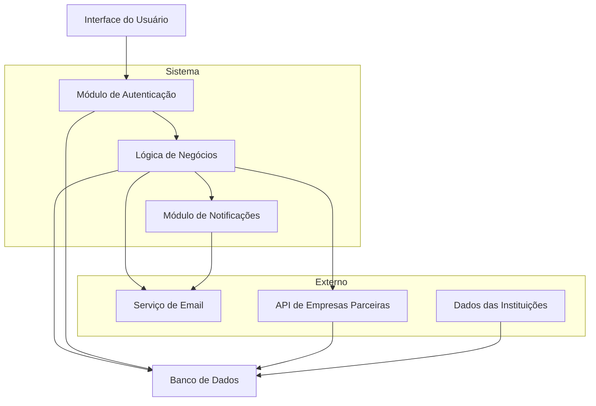

# Diagrama de componentes

```mermaid
flowchart TD
    %% Definição dos componentes
    UI["Interface do Usuário"]
    Auth["Módulo de Autenticação"]
    BusinessLogic["Lógica de Negócios"]
    Database["Banco de Dados"]
    EmailService["Serviço de Email"]
    Notification["Módulo de Notificações"]
    PartnerAPI["API de Empresas Parceiras"]
    InstitutionData["Dados das Instituições"]

    %% Interações
    UI --> Auth
    Auth --> BusinessLogic
    BusinessLogic --> Database
    BusinessLogic --> EmailService
    BusinessLogic --> PartnerAPI
    BusinessLogic --> Notification
    Notification --> EmailService
    Auth --> Database
    PartnerAPI --> Database
    InstitutionData --> Database

    %% Agrupamento de componentes
    subgraph Sistema
        Auth
        BusinessLogic
        Notification
    end

    subgraph Externo
        EmailService
        PartnerAPI
        InstitutionData
    end
```
