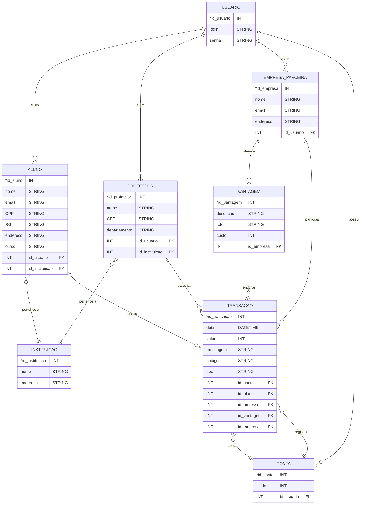

# Diagrama Entidade-Relacionamento

```mermaid
erDiagram
    %% Entidades
    USUARIO {
        *id_usuario INT
        login STRING
        senha STRING
    }
    ALUNO {
        *id_aluno INT
        nome STRING
        email STRING
        CPF STRING
        RG STRING
        endereco STRING
        curso STRING
        INT id_usuario FK
        INT id_instituicao FK
    }
    PROFESSOR {
        *id_professor INT
        nome STRING
        CPF STRING
        departamento STRING
        INT id_usuario FK
        INT id_instituicao FK
    }
    EMPRESA_PARCEIRA {
        *id_empresa INT
        nome STRING
        email STRING
        endereco STRING
        INT id_usuario FK
    }
    INSTITUICAO {
        *id_instituicao INT
        nome STRING
        endereco STRING
    }
    VANTAGEM {
        *id_vantagem INT
        descricao STRING
        foto STRING
        custo INT
        INT id_empresa FK
    }
    CONTA {
        *id_conta INT
        saldo INT
        INT id_usuario FK
    }
    TRANSACAO {
        *id_transacao INT
        data DATETIME
        valor INT
        mensagem STRING
        codigo STRING
        tipo STRING
        INT id_conta FK
        INT id_aluno FK
        INT id_professor FK
        INT id_vantagem FK
        INT id_empresa FK
    }

    %% Relacionamentos
    USUARIO ||--o{ ALUNO : "é um"
    USUARIO ||--o{ PROFESSOR : "é um"
    USUARIO ||--o{ EMPRESA_PARCEIRA : "é um"
    USUARIO ||--o{ CONTA : "possui"

    ALUNO }o--|| INSTITUICAO : "pertence a"
    PROFESSOR }o--|| INSTITUICAO : "pertence a"

    EMPRESA_PARCEIRA ||--o{ VANTAGEM : "oferece"

    CONTA ||--o{ TRANSACAO : "registra"

    ALUNO ||--o{ TRANSACAO : "realiza"
    PROFESSOR ||--o{ TRANSACAO : "participa"
    VANTAGEM ||--o{ TRANSACAO : "envolve"
    EMPRESA_PARCEIRA ||--o{ TRANSACAO : "participa"

    TRANSACAO }o--|| CONTA : "afeta"

```
